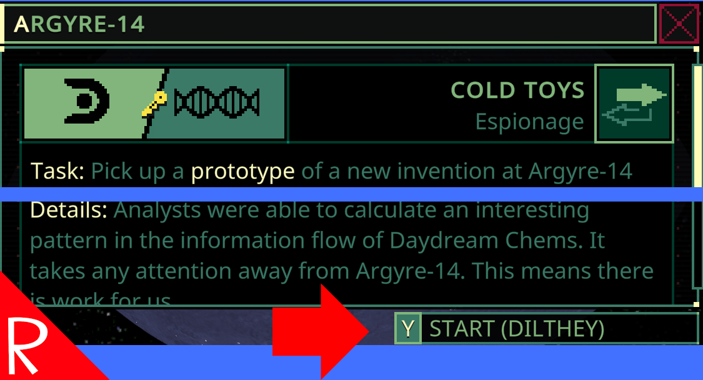

# Quasimorph Raid Show Ally

Changes the mission start button to include the faction that the player is raiding for.

With the new reverse mission functionality, this is a quick check that the player is choosing the desired side.  Especially useful when the player exits the raid dialog and returns.

# Support
If you enjoy my mods and want to buy me a coffee, check out my [Ko-Fi](https://ko-fi.com/nbkredspy71915) page.
Thanks!

# Source Code
Source code is available on GitHub at https://github.com/NBKRedSpy/QM_RaidShowAlly

# Change Log

## 1.1.0
* Compatible with the 0.8.6 opt in beta 
