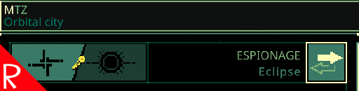

# Remember Mission Side

Ever started the wrong side of a mission because the mission screen reset to the default side?
For instance, accidentally hitting escape, which brings the user back to the ship screen.

This mod remembers the side chosen when re-opening a mission.  

# Support
If you enjoy my mods and want to buy me a coffee, check out my [Ko-Fi](https://ko-fi.com/nbkredspy71915) page.
Thanks!

# Source Code
Source code is available on GitHub at https://github.com/NBKRedSpy/QM_RaidShowAlly

# Change Log
## 1.2.1
* Removed the side name on the button as the game now has this.

## 1.2.0
* Added remembering side.
* Changed "friendly" name of the mod.

## 1.1.1 
* 0.9.8.2 compatibility.

## 1.1.0
* Compatible with the 0.8.6 opt in beta 
